# GreenTrace Lucid Sunset Implementation Plan

This document outlines the plan for implementing the "Lucid Sunset" design theme across the GreenTrace desktop platform based on the Stitch designs.

## Brand Aesthetics
- **Theme**: Lucid Sunset
- **Vibe**: Sleek, spacious, modern, and user-friendly.
- **Colors**: Warm sunset orange/pink gradients combined with dark/light modern UI elements and subtle earthy green accents for status/actions.
- **Layout**: Wide desktop optimized, card-based with generous padding and negative space.
- **Components**: Glassmorphism effects, clean data tables, responsive navigation sidebars.

## Reference Designs
*The following screenshots have been generated and saved to `docs/designs/` for reference during implementation.*

### 1. Common Pages
- **Landing Page**: Hero section, value proposition.
  - 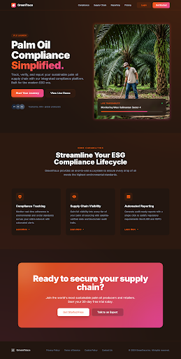
- **Login Page**: Split layout with sunset graphic.
  - 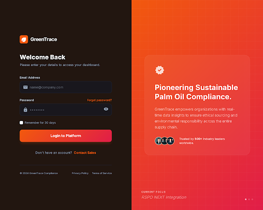
- **Reset Password**: Clean focus form.
  - 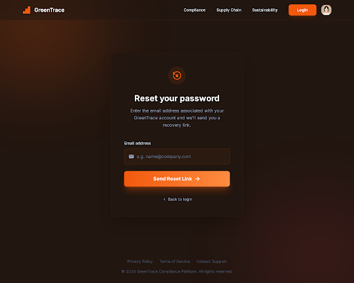

### 2. Aggregator (Super Admin) Views
- **Dashboard**: High-level metrics, interactive map.
  - 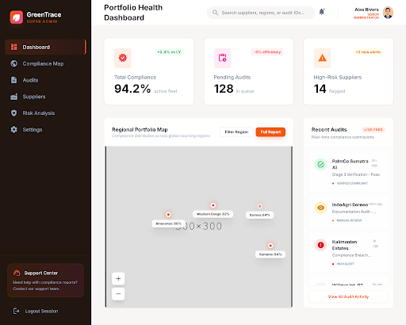
- **Mill Portfolio**: Comprehensive list with filtering.
  - 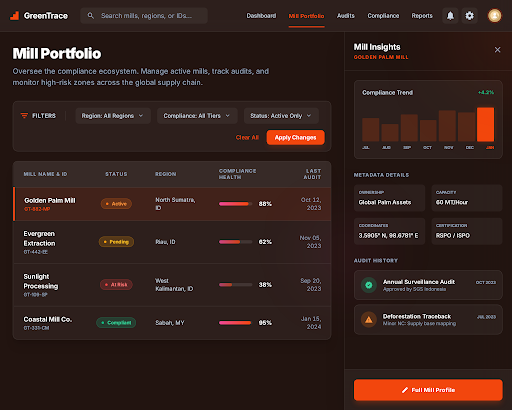
- **Regulation Profiles**: Managing compliance frameworks.
  - 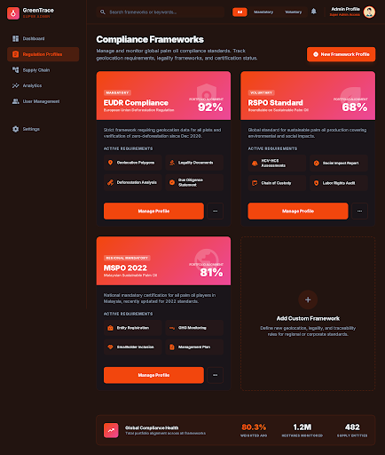
- **Checklist Builder**: Drag-and-drop template creation.
  - 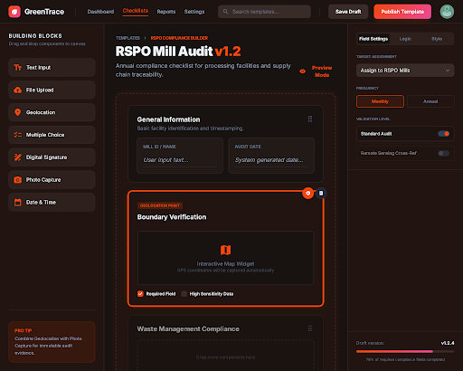
- **User Management**: Unified table of all platform users.
  - 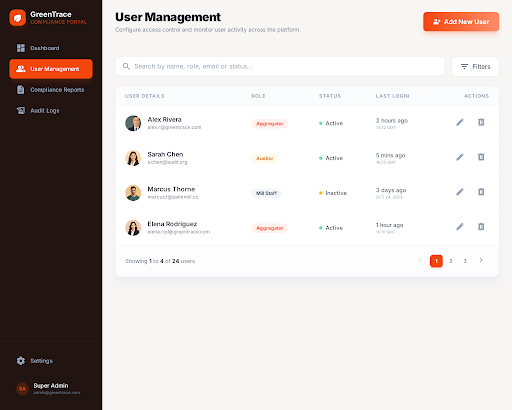

### 3. Auditor Views
- **Dashboard**: Audit queue and personal metrics.
  - 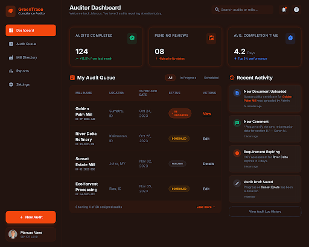
- **Review Workspace**: Split-pane document viewer and approval checklist.
  - 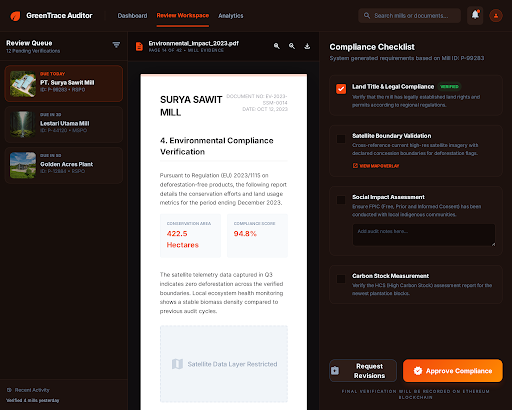

### 4. Mill Staff Views
- **Dashboard**: Active tasks and high-level metrics.
  - 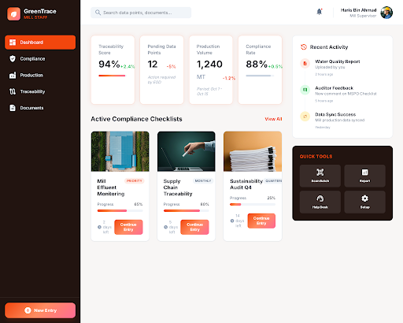
- **Checklist Data Entry**: Step-by-step form and evidence upload.
  - 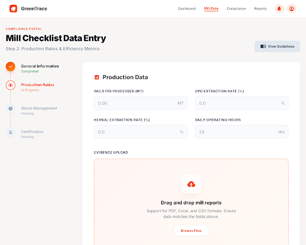
- **Trade & Imports Ledger**: Complex data table with side-modal data entry.
  - 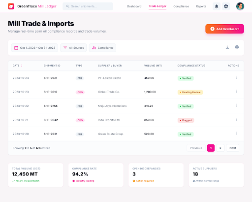
- **Account Settings**: Profile and preferences.
  - 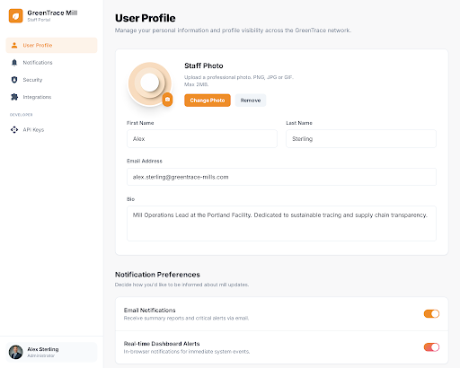

## Implementation Steps

1.  **Design System Setup**:
    -   Define Tailwind configuration (colors, fonts, gradients) to match the Lucid Sunset palette.
    -   Create base UI components (Buttons, Inputs, Cards, Badges) reflecting the new design language.
2.  **Layout Implementation**:
    -   Implement the main structural layouts (Sidebar + Main Content area) for authenticated routes.
    -   Ensure responsiveness (the desktop-first designs will be adapted for mobile).
3.  **Page-by-Page Rollout**:
    -   **Phase 1**: Common pages (Auth flow & Landing).
    -   **Phase 2**: Core Dashboards (Aggregator, Auditor, Mill).
    -   **Phase 3**: Data Entry Views (Checklists, Ledgers).
    -   **Phase 4**: Management Views (Settings, Users, Regulations).

### 5. Brand Identity
- **Logo Concepts**: Scalable vector logos incorporating the Lucid Sunset gradient and leaf/data motifs.
  - 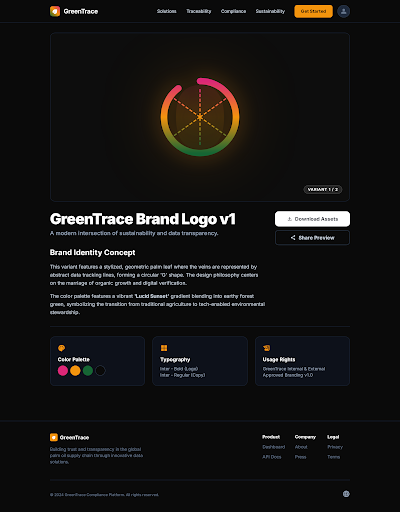
  - 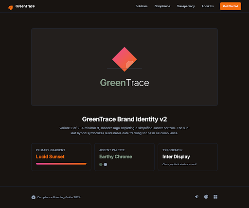

### 5. Brand Identity
- **Logo Concepts**: Scalable vector logos incorporating the Lucid Sunset gradient and leaf/data motifs.
  - 
  - 
